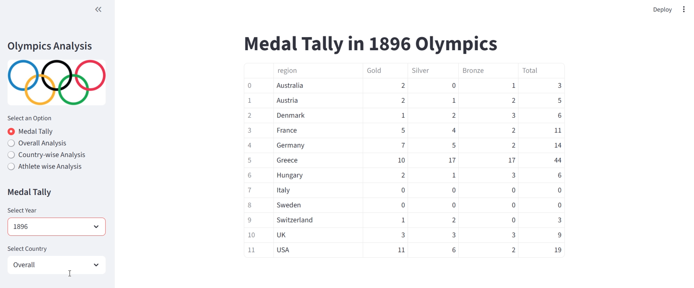

# Olympics Analysis WebApp

_An interactive platform to explore 120 years of Olympic data, trends, and athlete and country performance insights._

---

## 📌 Table of Contents
- <a href="#Overview">Overview</a>
- <a href="#dataset">Dataset</a>
- <a href="#tools--technologies">Tools & Technologies</a>
- <a href="#project-structure">Project Structure</a>
- <a href="#data-cleaning--preparation">Data Cleaning & Preparation</a>
- <a href="#exploratory-data-analysis-eda">Exploratory Data Analysis (EDA)</a>
- <a href="#dashboard">Dashboard</a>
- <a href="#how-to-run-this-project">How to Run This Project</a>
- <a href="#final-recommendations">Final Recommendations</a>
- <a href="#author--contact">Author & Contact</a>

---
<h2><a class="anchor" id="overview"></a>Overview</h2>

An interactive platform to explore and analyze 120 years of Olympic data. It provides insights into medal trends, top-performing countries and athletes, and sport-wise statistics. The app turns complex historical data into easy-to-understand visualizations for quick analysis.

---
<h2><a class="anchor" id="dataset"></a>Dataset</h2>

- Multiple CSV files located in `/Data/` folder 
- Summary table created from ingested data and used for analysis

---
<h2><a class="anchor" id="tools--technologies"></a>Tools & Technologies</h2>

- Python (NumPy, Pandas, Matplotlib, Seaborn, Plotly)
- Streamlit (Interactive Visualizations)
- GitHub

---
<h2><a class="anchor" id="project-structure"></a>Project Structure</h2>

```
Olympics-Analysis(1896-2016)/
│
├── README.md
├── .gitignore
├── requirements.txt
├── scripts/                    # Python scripts for ingestion and processing
│   ├── app.py
│   └── helper.py
│   └── preprocess.py
```

---
<h2><a class="anchor" id="data-cleaning--preparation"></a>Data Cleaning & Preparation</h2>

- Handle missing values
- Standardize country and sport names
- Correct data types
- Remove duplicates
- Create useful columns (total medals, age, season)
- Validate data consistency

---
<h2><a class="anchor" id="exploratory-data-analysis-eda"></a>Exploratory Data Analysis (EDA)</h2>

- Analyze medal trends over the years
- Identify top-performing countries and athletes
- Explore sport-wise and event-wise statistics
- Visualize participation patterns by year and season
- Examine correlations between athlete attributes (age, height, weight) and performance
- Highlight interesting historical insights and records

---
<h2><a class="anchor" id="dashboard"></a>Dashboard</h2>

- Streamlit Dashboard shows:
    - Medal Tally
    - Overall Analysis
    - Country-wise Analysis
    - Athlete wise Analysis



---
<h2><a class="anchor" id="how-to-run-this-project"></a>How to Run This Project</h2>

1. Clone the repository:
```bash
git clone https://github.com/noturbhavya/Olympics-Analysis-WebApp
```
3. Load the CSVs and ingest into database:
```bash
python Scripts/app.py
```
4. Open Terminal and run:
   - `python -m streamlit run app.py`

---
<h2><a class="anchor" id="final-recommendations"></a>Final Recommendations</h2>

- Use the app to identify trends and patterns in Olympic performance over time.
- Analyze top-performing countries and athletes to understand dominance in different sports.
- Explore sport-wise medal distributions for strategic insights.
- Utilize the dashboard for educational or analytical purposes, such as research or presentations.
- Consider extending the app with future Olympics data for continuous insights.
- Enhance the analysis by adding predictive modeling or athlete performance forecasts.

---
<h2><a class="anchor" id="author--contact"></a>Author & Contact</h2>

**Bhavya Patela**
Data Scientist
📧 Email: bhavyapatela100@gmail.com
🔗 [LinkedIn](https://www.linkedin.com/in/bhavya-patela-526a38322/)